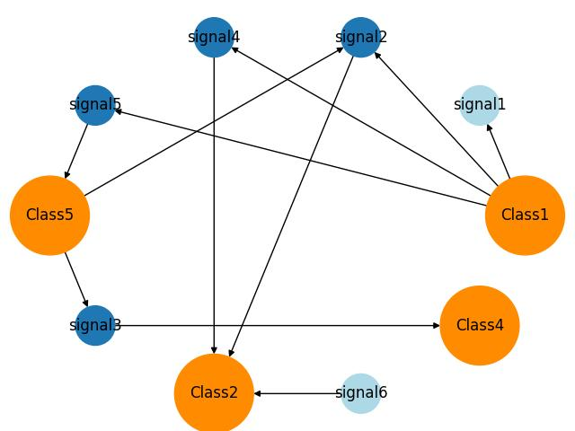

## Message broker grapher

A simple documentation tool for generating directed graphs from [message broker](https://en.wikipedia.org/wiki/Message_broker) services and signals.

Check [example.py](./example.py) script on how to use. The resulting graph has emitters in orange, emitted signals in blue and orphaned signals (either no owner or listener) in light blue.

Requires:
matplotlib, networkx